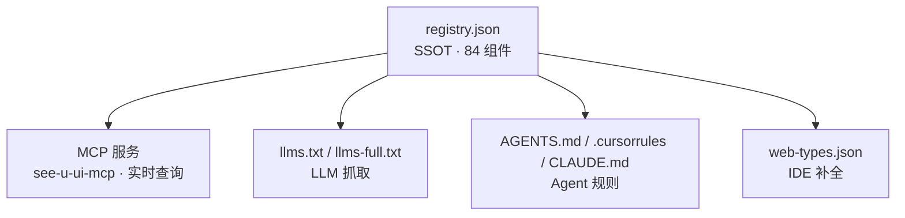

# AI 总览

> SeeYouUI 不只是为人设计的组件库，也是为 AI 设计的。

## 核心理念

我们相信，未来的软件开发会有 AI 深度参与。所以从一开始，SeeYouUI 就把组件库打造成 **AI 原生友好（AI-native）**：不是事后补一份文档给 AI 看，而是让组件库本身就能被 AI 精准地读写。

具体来说，我们做了三件事：

- **一份单一数据源（SSOT）**：所有组件的 props / events / slots / 示例，都从组件源码自动提取到一个 `registry.json`，一次维护、多处生成，永远不会和代码脱节。
- **多种 AI 可消费的产物**：从这一份 SSOT 自动派生出 MCP 服务、LLMs.txt、Agent 规则文件、IDE 补全等，覆盖主流 AI 工具的接入方式。
- **按需查询，不占上下文**：AI 不必把整份 API 文档塞进上下文，需要哪个组件就查哪个，精准供给。

## 能力一览

| 能力 | 适合谁 | 怎么用 | 链接 |
| --- | --- | --- | --- |
| 🤖 MCP 服务 | [Cursor](https://www.cursor.com/) / [Claude Code](https://docs.anthropic.com/en/docs/claude-code/overview) 等 | 按需查询组件 API，不占上下文 | [MCP 接入](./mcp) |
| 📄 LLMs.txt | 任意大语言模型 | 抓取整站组件 API 概览 | [LLMs.txt](./llms) |
| 📝 Agent 规则 | [Cursor](https://www.cursor.com/) / [Claude Code](https://docs.anthropic.com/en/docs/claude-code/overview) 等 | 项目根规则文件，AI 自动读取 | [Agent 规则](./agents) |
| 💡 IDE 补全 | [JetBrains](https://www.jetbrains.com/) 系 IDE | 自动补全组件标签 / 属性 / 事件 | [IDE 补全](./web-types) |

## 数据流全景

一份 SSOT，派生七种产物，覆盖几乎所有 AI 工具入口：

改一处源头（组件源码 + `meta.ts`），运行 `pnpm ai:gen` 即可同步刷新所有 AI 入口，无需分别维护。

## 覆盖范围

- **84 个组件** 100% 覆盖，每个都有完整元数据（`withMeta = 84 / 84`）
- **959 个属性** / **149 个事件** / **124 个插槽**，全部结构化暴露
- **联合字面量类型已内联**：像 `'primary' | 'error' | 'warning'` 这种合法取值，AI 直接可见、无需推测
- **一致性自检**：生成时校验 `missingMeta` / `metaError` / `noProps` / `noVue`，数据可信

## 从哪开始

- 想让 AI 助手在写代码时实时查组件？看 [MCP 接入](./mcp)
- 想让大模型一次性了解全库？看 [LLMs.txt](./llms)
- 想让 AI 打开项目就懂 SeeYouUI 约定？看 [Agent 规则](./agents)
- 想在 IDE 里自动补全？看 [IDE 补全](./web-types)
