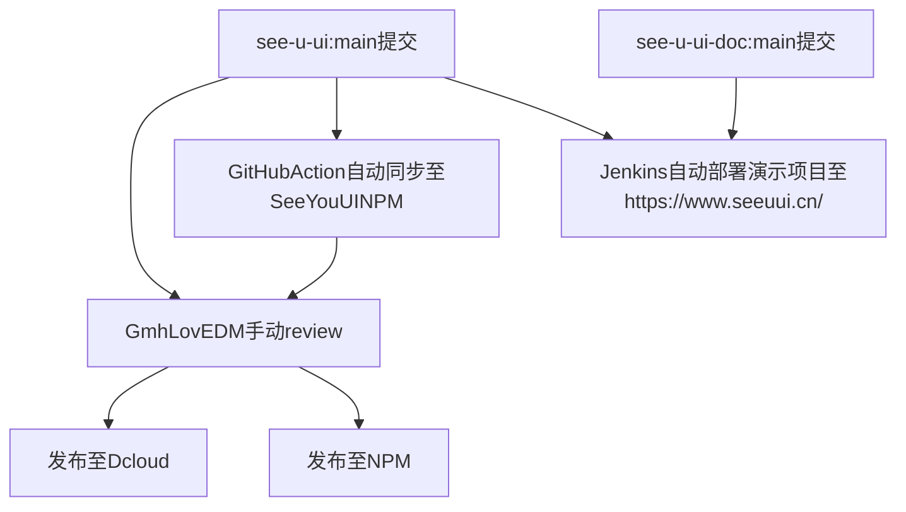

# 贡献指南

> 感谢您愿意为 SeeYouUI 贡献自己的力量，请你在提 Issue 或者 PullRequest 之前花几分钟来阅读一遍这篇指南。

## 分支管理

我们长期维护 master，feature 和 dev 这三个分支。如果你要修一个 bug，请发 PullRequest 到 `dev` 分支，如果你要提一个增加新功能的 PullRequest，那么请基于 `feature` 分支来做，每月末我们会合并 `feature` 到 `master`，并发布至 Dcloud 和 npm。

## 新增功能

如果你有改进我们现有组件或新增组件的想法，请新建一个新功能的 Issue，并且在 `feature` 分支开发。

## 关于 Bugs

如果你想要你发现的 bug 被快速解决，最好的办法就是提交 Issue，我们会尽快修复，

请确保你的 bug 是可以复现的，并且提供尽可能多的代码和截图，这样我们才能更快地找到问题所在。

**_如果你有能力，也可以直接在 `dev` 分支下提 PullRequest，这样可以加速修复过程。_**

## 第一次贡献

如果你还不清楚怎么在 GitHub 上提 Pull Request ，可以阅读下面这篇文章来学习：[如何优雅地在 GitHub 上贡献代码](https://segmentfault.com/a/1190000000736629)

## 我们的开发流程

## 加入社区

如果你的贡献度足够高，并且希望和 SeeYouUI 团队一起参与维护工作，你可以[申请成为社区协作者](mailto:GmhLovEDM@gmail.com)。

你也可以在 [关于我们](./about.md) 中了解当前的主要协作者。
