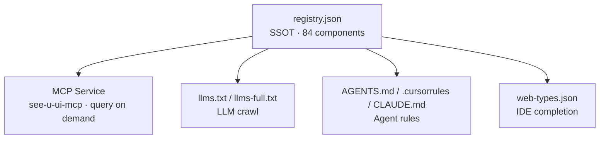

# AI Overview

> SeeYouUI is not just a component library for humans - it's built for AI, too.

## Core Philosophy

We believe AI will be deeply involved in future software development. So from day one, SeeYouUI has been designed to be **AI-native**: instead of bolting on a doc for AI as an afterthought, the library itself is machine-readable and machine-writable.

Concretely, we did three things:

- **A Single Source of Truth (SSOT)**: every component's props / events / slots / examples are auto-extracted from source code into one `registry.json`. Maintain once, generate everywhere - it never drifts from the code.
- **Multiple AI-consumable artifacts**: from that one SSOT, we auto-derive an MCP service, LLMs.txt, agent rule files, IDE completion - covering the integration entry points of mainstream AI tools.
- **Query on demand, save context**: AI doesn't have to stuff the entire API doc into context. It queries the component it needs, precisely.

## Capabilities

| Capability | For whom | How | Link |
| --- | --- | --- | --- |
| 🤖 MCP Service | [Cursor](https://www.cursor.com/) / [Claude Code](https://docs.anthropic.com/en/docs/claude-code/overview) etc. | Query component API on demand, no context bloat | [MCP Integration](./mcp) |
| 📄 LLMs.txt | Any LLM | Crawl the whole component API overview | [LLMs.txt](./llms) |
| 📝 Agent Rules | [Cursor](https://www.cursor.com/) / [Claude Code](https://docs.anthropic.com/en/docs/claude-code/overview) etc. | Root rule files, auto-read by AI | [Agent Rules](./agents) |
| 💡 IDE Completion | [JetBrains](https://www.jetbrains.com/) IDEs | Autocomplete tags / props / events | [IDE Completion](./web-types) |

## Data Flow

One SSOT, seven artifacts, covering almost every AI tool entry point:

Change one source (component source + `meta.ts`), run `pnpm ai:gen`, and every AI entry point refreshes together - no separate maintenance.

## Coverage

- **84 components** 100% covered, each with full metadata (`withMeta = 84 / 84`)
- **959 props** / **149 events** / **124 slots**, all structured and exposed
- **Union literals inlined**: legal values like `'primary' | 'error' | 'warning'` are directly visible to AI - no guessing
- **Consistency checks**: `missingMeta` / `metaError` / `noProps` / `noVue` validated at generation time, data you can trust

## Where to Start

- Want AI to query components live while coding? See [MCP Integration](./mcp)
- Want an LLM to understand the whole library at once? See [LLMs.txt](./llms)
- Want AI to know SeeYouUI conventions on project open? See [Agent Rules](./agents)
- Want IDE autocomplete? See [IDE Completion](./web-types)
