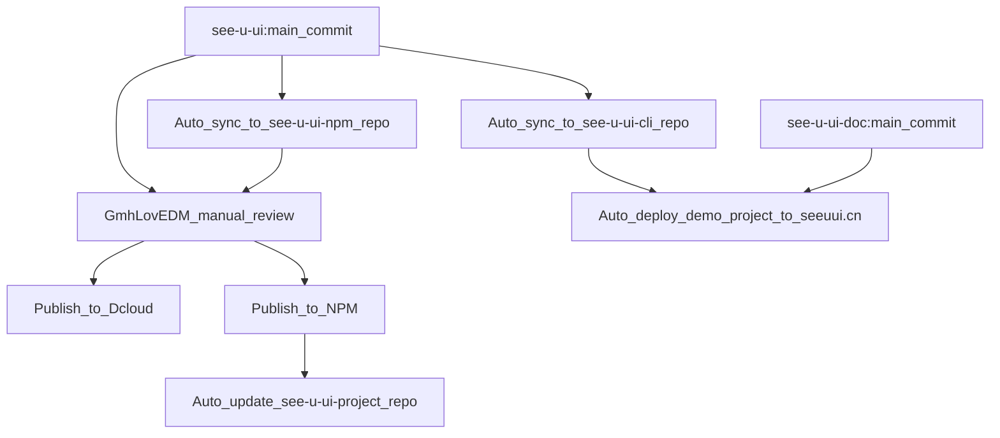

# Contribution Guide

> Thank you for your interest in contributing to SeeYouUI. Please take a few minutes to read through this guide before submitting an Issue or a Pull Request.

## Branch Management

We maintain three long-term branches: `master`, `feature`, and `dev`. If you want to fix a bug, please submit a Pull Request to the `dev` branch. If you want to propose a new feature, please do so based on the `feature` branch. At the end of each month, we merge `feature` into `master` and publish to Dcloud and npm.

## New Features

If you have ideas for improving our existing components or adding new ones, please create a "New Feature" Issue and develop it within the `feature` branch.

## About Bugs

If you want a bug you've discovered to be resolved quickly, the best way is to submit an Issue. We will fix it as soon as possible.

Please ensure your bug is reproducible and provide as much code and as many screenshots as possible so that we can locate the problem faster.

**_If you have the capability, you can also submit a Pull Request directly to the `dev` branch, which can accelerate the fix process._**

## First-time Contribution

If you are not yet sure how to submit a Pull Request on GitHub, you can read the following article to learn: [How to Gracefully Contribute Code on GitHub](https://gmhlovedm.github.io/blog/2-github-pr/en)

## Our Development Workflow

## Join the Community

If your contribution level is significant and you wish to participate in maintenance work alongside the SeeYouUI team, you can [apply to become a community collaborator](mailto:GmhLovEDM@gmail.com).

You can also learn about the current main collaborators in [About Us](https://www.google.com/search?q=./about.md).